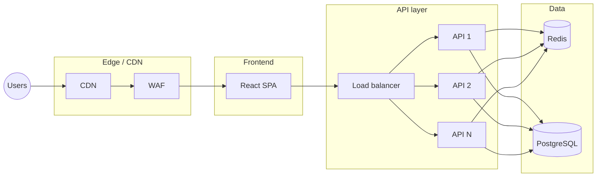

# Scaling to ~1M Users: Roadmap and Infrastructure

This doc outlines what to change in the **React app**, **API (FastAPI)**, and **database** to support on the order of **1 million users** and high request volume. It covers bottlenecks, infrastructure choices, and a simple flow.

---

## Suggested GitHub repo name

**`react-auth-template`** or **`auth-stack-template`**

- Short, clear, and searchable. Alternatives: `fullstack-auth-scaffold`, `user-auth-template`, `react-fastapi-auth`.

---

## 1. High-level flow at scale

- **React**: Static assets from CDN; app talks to your API only.
- **API**: Stateless, behind a load balancer; scale by adding instances.
- **Database**: PostgreSQL (primary); Redis for sessions/cache and rate limits.

---

## 2. React (frontend)

| Current | At scale | Notes |
|--------|----------|--------|
| Single Vite build, dev proxy | Build → static host (e.g. S3 + CloudFront, Vercel, Netlify) | No server-side scaling; CDN scales. |
| `VITE_API_URL` to one origin | Same; API_URL = your API domain or LB | Use env at build time. |
| No CDN | All JS/CSS/images from CDN | Lower latency, less load on your API. |
| Client-side only | Same | No change; keep auth cookie-based. |

**Bottlenecks:** None on the app itself; scaling is “host on CDN + good caching.”

**Roadmap:**

- Put the built `dist/` behind a CDN (e.g. CloudFront, Cloudflare).
- Set long cache headers for hashed assets; keep `index.html` short-cached or no-cache.
- Use `VITE_API_URL` for the real API base URL in production.
- Optional: Error/analytics (e.g. Sentry, PostHog) and RUM; no structural change.

---

## 3. API (FastAPI)

| Current | At scale | Notes |
|--------|----------|--------|
| One process (uvicorn) | Multiple processes/hosts behind a load balancer | Stateless; scale horizontally. |
| SQLite, single file | PostgreSQL (or similar) | One DB for all API instances. |
| JWT in httpOnly cookie | Same, or short-lived JWT + Redis session store | Keep cookies; optional Redis session lookup. |
| No rate limiting | Rate limit at LB or in app (e.g. Redis) | Protect login/register/forgot-password. |
| Logs to stdout | Structured logs → aggregator (e.g. CloudWatch, Datadog) | Debugging and alerts. |
| No health checks | `/health` (and maybe `/ready`) | LB and orchestrator use these. |

**Bottlenecks:**

- **CPU:** Password hashing (bcrypt) is intentionally slow. Mitigate: keep cost factor reasonable; optional per-request queue so one slow request doesn’t starve others.
- **I/O:** DB and (if used) Redis. Fix by connection pooling, caching, and DB sizing.
- **Single process:** Replaced by many instances behind a load balancer.

**Roadmap:**

- **Database:** Move to PostgreSQL (or managed: RDS, Cloud SQL). Use connection pooling (e.g. PgBouncer, or SQLAlchemy pool limits).
- **Sessions:** Option A: Keep current JWT-in-cookie (stateless). Option B: Short-lived access token + Redis session store for revocation and “sessions list.”
- **Rate limiting:** Per-IP and per-email on auth endpoints; store counters in Redis; return 429 when over limit.
- **Horizontal scaling:** Run N uvicorn workers (or N containers/pods); put a load balancer (ALB, nginx, cloud LB) in front; share no local state.
- **Health:** `GET /health` returns 200; optional `GET /ready` that checks DB (and Redis) connectivity.
- **Secrets:** Env or secret manager (e.g. AWS Secrets Manager); never commit secrets.
- **CORS:** Restrict to your frontend origin(s) and (if needed) API subdomain.

---

## 4. Database

| Current | At scale | Notes |
|--------|----------|--------|
| SQLite, single file | PostgreSQL (single primary + replicas if needed) | One primary for writes; replicas for read scaling. |
| No connection pooling | PgBouncer or app-level pool (e.g. SQLAlchemy pool_size, max_overflow) | Cap connections per API instance. |
| No read replicas | 1 primary + 1+ read replicas | Route read-only queries (e.g. GET /auth/me, profile reads) to replicas. |
| No backups | Automated daily (or more) backups; point-in-time recovery | Managed DBs do this; otherwise pg_dump + WAL archiving. |
| No indexes beyond PK/unique | Add indexes for hot queries (e.g. email, user_id, token, created_at) | Avoid full table scans on large tables. |

**Bottlenecks:**

- **Connections:** Each process holds DB connections. Too many processes → too many connections. Use a pool (and PgBouncer) and size `max_connections` on the DB.
- **Single primary:** Write throughput has an upper bound. For ~1M users, one well-sized primary is usually enough; sharding is for much larger scale.
- **Slow queries:** Index auth lookups (email, token, user_id); monitor and tune with EXPLAIN.

**Roadmap:**

- Migrate to PostgreSQL; use async driver (e.g. asyncpg) and SQLAlchemy async as you already have.
- Add indexes, e.g.:
  - `users(email)` (you likely have unique already),
  - `password_reset_tokens(token)`, `email_verify_tokens(token)`,
  - Any other filters used in hot paths.
- Configure connection pool: e.g. `pool_size=10`, `max_overflow=5` per API instance; total across instances < DB `max_connections`.
- Optional: Read replicas and read-only engine in the app for GETs; primary for writes and strong consistency.
- Backups and retention per your RTO/RPO; test restore.

---

## 5. Caching and sessions (optional but recommended)

- **Redis** (or equivalent managed cache):
  - **Rate limiting:** Store per-IP and per-email counters; TTL = window (e.g. 1 hour).
  - **Sessions (optional):** If you move to “short-lived JWT + Redis session,” store session id → user id (and maybe metadata); check on each request.
  - **Caching:** Cache hot read-only data (e.g. user profile by id) with short TTL to reduce DB load.
- **Sizing:** Single Redis instance is often enough for ~1M users; cluster when you need more throughput or HA.

---

## 6. Infrastructure sketch for ~1M users

- **Frontend:** React build on S3 (or similar) + CloudFront (or Cloudflare). No scaling work beyond CDN.
- **API:** Containers (e.g. ECS, Cloud Run, EKS) or VMs behind a load balancer; auto-scale on CPU/request count; health checks on `/health`.
- **Database:** Managed PostgreSQL (RDS, Cloud SQL, etc.) with a single primary; add read replica(s) if read traffic grows.
- **Cache:** Managed Redis (ElastiCache, Memorystore, etc.) for rate limits and optional sessions/cache.
- **Email:** Keep current SMTP or switch to SendGrid/Mailgun/SES for deliverability and scale.
- **Secrets:** Stored in env or a secret manager; rotated for DB and API keys.
- **Monitoring:** Metrics (CPU, memory, request rate, latency, errors), logs aggregation, and alerts (e.g. 5xx rate, DB connections, Redis memory).

---

## 7. Bottleneck summary

| Layer | Main bottleneck | Mitigation |
|-------|-----------------|------------|
| React | None at scale | CDN + static hosting. |
| API | bcrypt CPU; DB/Redis I/O | Pool size; optional job queue for heavy work; DB + Redis tuning. |
| Database | Connections; write throughput; slow queries | Pooling; PgBouncer; indexes; read replicas for reads. |
| Auth endpoints | Abuse (credential stuffing, enumeration) | Rate limiting (Redis); optional CAPTCHA; lockout policy. |

---

## 8. Order of operations (roadmap)

1. **Move DB to PostgreSQL** and add connection pooling and basic indexes.
2. **Add health endpoint** and run API behind a load balancer with 2+ instances.
3. **Add rate limiting** (Redis) on login, register, forgot-password.
4. **Host React on CDN** and set production `VITE_API_URL`.
5. **Introduce Redis** for rate limits (and optionally sessions/cache).
6. **Add read replica(s)** and route read-only queries there if DB becomes the bottleneck.
7. **Structured logging and monitoring** (logs, metrics, alerts).
8. **Email:** Use a transactional provider (SES, SendGrid, etc.) and tune templates/deliverability.

This order gets you to a production-ready setup that can grow toward ~1M users without a rewrite; further scaling (sharding, event-driven flows, etc.) can be added when metrics justify it.
